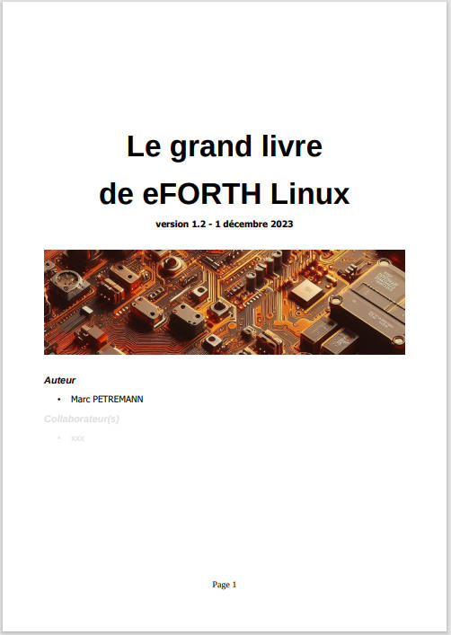

<h1>Sommaire</h1>

<b><a href="#__RefHeading___Toc11147_661641570">Installer
eForth sous Linux	4</a></b>

<a href="#__RefHeading___Toc11149_661641570">Prérequis	4</a>

<a href="#__RefHeading___Toc11151_661641570">Installer
eForth Linux sous Linux	5</a>

<a href="#__RefHeading___Toc11153_661641570">Lancer
eForth Linux	5</a>

<b><a href="#__RefHeading___Toc11155_661641570">Un
vrai FORTH 64 bits avec eForth Linux	7</a></b>

<a href="#__RefHeading___Toc11157_661641570">Les
valeurs sur la pile de données	7</a>

<a href="#__RefHeading___Toc11159_661641570">Les
valeurs en mémoire	7</a>

<a href="#__RefHeading___Toc11161_661641570">Traitement
par mots selon taille ou type des données	8</a>

<a href="#__RefHeading___Toc11163_661641570">Conclusion	9</a>

<b><a href="#__RefHeading___Toc11165_661641570">Edition
et gestion fichiers sources pour eForth Linux	11</a></b>

<a href="#__RefHeading___Toc11167_661641570">Les
éditeurs de fichiers texte	11</a>

<a href="#__RefHeading___Toc11169_661641570">Stockage
sur GitHub	11</a>

<a href="#__RefHeading___Toc11171_661641570">Editer
des fichiers pour eForth Linux depuis Windows	12</a>

<a href="#__RefHeading___Toc11173_661641570">Création
et gestion de projets FORTH avec Netbeans	13</a>

<a href="#__RefHeading___Toc11175_661641570">Créer
un projet eForth avec Netbeans	13</a>

<a href="#__RefHeading___Toc11177_661641570">Quelques
bonnes pratiques	15</a>

<a href="#__RefHeading___Toc11179_661641570">Exécution
du contenu d’un fichier par eForth Linux	16</a>

<b><a href="#__RefHeading___Toc11181_661641570">Le
système de fichiers Linux	18</a></b>

<a href="#__RefHeading___Toc11183_661641570">Manipulation
des fichiers	18</a>

<a href="#__RefHeading___Toc11185_661641570">Organiser
et compiler ses fichiers avec eForth Linux	19</a>

<a href="#__RefHeading___Toc11187_661641570">Organiser
ses fichiers	20</a>

<a href="#__RefHeading___Toc11189_661641570">Enchaînement
des fichiers	20</a>

<a href="#__RefHeading___Toc11191_661641570">Conclusion	21</a>

<b><a href="#__RefHeading___Toc11193_661641570">Commentaires
et mise au point	22</a></b>

<a href="#__RefHeading___Toc11195_661641570">Ecrire
un code FORTH lisible	22</a>

<a href="#__RefHeading___Toc11197_661641570">Indentation
du code source	23</a>

<a href="#__RefHeading___Toc11199_661641570">Les
commentaires	24</a>

<a href="#__RefHeading___Toc11201_661641570">Les
commentaires de pile	24</a>

<a href="#__RefHeading___Toc11203_661641570">Signification
des paramètres de pile en commentaires	25</a>

<a href="#__RefHeading___Toc11205_661641570">Commentaires
des mots de définition de mots	26</a>

<a href="#__RefHeading___Toc11207_661641570">Les
commentaires textuels	26</a>

<a href="#__RefHeading___Toc11209_661641570">Commentaire
en début de code source	27</a>

<a href="#__RefHeading___Toc11211_661641570">Outils
de diagnostic et mise au point	27</a>

<a href="#__RefHeading___Toc11213_661641570">Le
décompilateur	27</a>

<a href="#__RefHeading___Toc11215_661641570">Dump
mémoire	28</a>

<a href="#__RefHeading___Toc11217_661641570">Moniteur
de pile	28</a>

<b><a href="#__RefHeading___Toc11219_661641570">Dictionnaire
/ Pile / Variables / Constantes	30</a></b>

<a href="#__RefHeading___Toc11221_661641570">Étendre
le dictionnaire	30</a>

<a href="#__RefHeading___Toc11223_661641570">Gestion
du dictionnaire	30</a>

<a href="#__RefHeading___Toc11225_661641570">Piles
et notation polonaise inversée	31</a>

<a href="#__RefHeading___Toc11227_661641570">Manipulation
de la pile de paramètres	32</a>

<a href="#__RefHeading___Toc11229_661641570">La
pile de retour et ses utilisations	32</a>

<a href="#__RefHeading___Toc11231_661641570">Utilisation
de la mémoire	33</a>

<a href="#__RefHeading___Toc11233_661641570">Variables	33</a>

<a href="#__RefHeading___Toc11235_661641570">Constantes	33</a>

<a href="#__RefHeading___Toc11237_661641570">Valeurs
pseudo-constantes	34</a>

<a href="#__RefHeading___Toc11239_661641570">Outils
de base pour l'allocation de mémoire	34</a>

<b><a href="#__RefHeading___Toc11241_661641570">Les
variables locales avec eForth Linux	36</a></b>

<a href="#__RefHeading___Toc11243_661641570">Introduction	36</a>

<a href="#__RefHeading___Toc11245_661641570">Le
faux commentaire de pile	36</a>

<a href="#__RefHeading___Toc11247_661641570">Action
sur les variables locales	37</a>

<b><a href="#__RefHeading___Toc11249_661641570">Structures
de données pour eForth Linux	40</a></b>

<a href="#__RefHeading___Toc11251_661641570">Préambule	40</a>

<a href="#__RefHeading___Toc11253_661641570">Les
tableaux en FORTH	40</a>

<a href="#__RefHeading___Toc11255_661641570">Tableau
de données 32 bits à une dimension	40</a>

<a href="#__RefHeading___Toc11257_661641570">Mots
de définition de tableaux	41</a>

<a href="#__RefHeading___Toc11259_661641570">Gestion
de structures complexes	41</a>

<b><a href="#__RefHeading___Toc11261_661641570">Les
nombres réels avec eForth Linux	44</a></b>

<a href="#__RefHeading___Toc11263_661641570">Les
réels avec eForth Linux	44</a>

<a href="#__RefHeading___Toc11265_661641570">Precision
des nombres réels avec eForth Linux	44</a>

<a href="#__RefHeading___Toc11267_661641570">Constantes
et variables réelles	45</a>

<a href="#__RefHeading___Toc11269_661641570">Opérateurs
arithmétiques sur les réels	45</a>

<a href="#__RefHeading___Toc11271_661641570">Opérateurs
mathématiques sur les réels	45</a>

<a href="#__RefHeading___Toc11273_661641570">Opérateurs
logiques sur les réels	46</a>

<a href="#__RefHeading___Toc11275_661641570">Transformations
entiers ↔ réels	46</a>

<b><a href="#__RefHeading___Toc11277_661641570">Affichage
des nombres et chaînes de caractères	48</a></b>

<a href="#__RefHeading___Toc11279_661641570">Changement
de base numérique	48</a>

<a href="#__RefHeading___Toc11281_661641570">Définition
de nouveaux formats d'affichage	49</a>

<a href="#__RefHeading___Toc11283_661641570">Affichage
des caractères et chaînes de caractères	51</a>

<a href="#__RefHeading___Toc11285_661641570">Variables
chaînes de caractères	53</a>

<a href="#__RefHeading___Toc11287_661641570">Code
des mots de gestion de variables texte	53</a>

<a href="#__RefHeading___Toc11289_661641570">Ajout
de caractère à une variable alphanumérique	55</a>

<b><a href="#__RefHeading___Toc11291_661641570">Les
mots de création de mots	57</a></b>

<a href="#__RefHeading___Toc11293_661641570">Utilisation
de does&gt;	57</a>

<a href="#__RefHeading___Toc11295_661641570">Exemple
de gestion de couleur	58</a>

<a href="#__RefHeading___Toc11297_661641570">Exemple,
écrire en pinyin	59</a>

<b><a href="#__RefHeading___Toc11299_661641570">Traitement
des caractères UTF8	60</a></b>

<a href="#__RefHeading___Toc11301_661641570">Le
codage UTF8	60</a>

<a href="#__RefHeading___Toc11303_661641570">Récupérer
le code de caractères UTF8 entrés au clavier	62</a>

<a href="#__RefHeading___Toc11305_661641570">Affichage
de caractères UTF8 depuis leur code	63</a>

